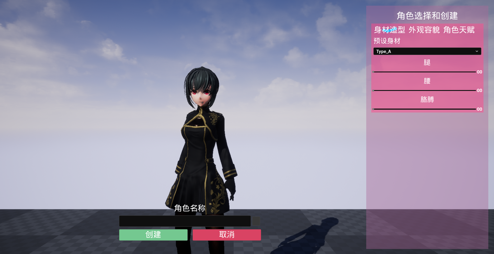

# MMOARPG Game

My First UE5 Learning Project.

Associated UE5 code: [Github - fseeeye/UE5EA](https://github.com/fseeeye/UE5EA/tree/mmoarpg)

## Local Testing

* Build UE5 from [Github - fseeeye/UE5EA](https://github.com/fseeeye/UE5EA/tree/mmoarpg).
* Lanuch servers by [Servers/ServerLauncher.bat](https://github.com/fseeeye/UE5EA/blob/mmoarpg/Servers/ServerLauncher.bat).
* Launch DS server by `DSServerPackage/LaunchDSServer.bat`.
* Launch Game by `GamePackage`.

## Road Map

- [x] Login Map
  - [x] Comm with Login Server 
- [x] Role Hall Map
  - [x] Comm with Gate Server
  - [x] Character Selection
  - [x] Character Creation
  - [x] Browse Color
- [x] Game Map
  - [x] Build Terrian
  - [x] Paint Terrian Matrial
  - [x] Comm with Dedicated Server
- [ ] Player & Partner
  - [x] C++ Character Base Classes
  - [x] Run & Jump
  - [x] Switch between Normal & Fight action state (sync in network)
  - [x] Add Weapon
  - [x] FootIK
  - [x] Switch Player & Partner
  - [x] Fly action state
  - [x] Swim action state
  - [ ] Climb action state
- [ ] Combat
  - [x]  Combo Attack Ability
  - [x]  Sprint & Dodge Ability
  - [ ]  Gameplay AttributeSet sync with Center Server
  - [ ]  Apply Gameplay Effect

## Achievement Exhibition

> Tips: click picture to view video

### Login and KneadFace

### IdleRun

[IdleRun video](https://fseeeye.me/gamemedia/IdleRun.mp4)

### FootIK

### Switch Character

[Switch Character video](https://fseeeye.me/gamemedia/SwitchCharacter.mp4)

### Fly

### Combat

[ComboAttack & Sprint & Dodge Ability video](https://fseeeye.me/gamemedia/SwitchCharacter.mp4)

